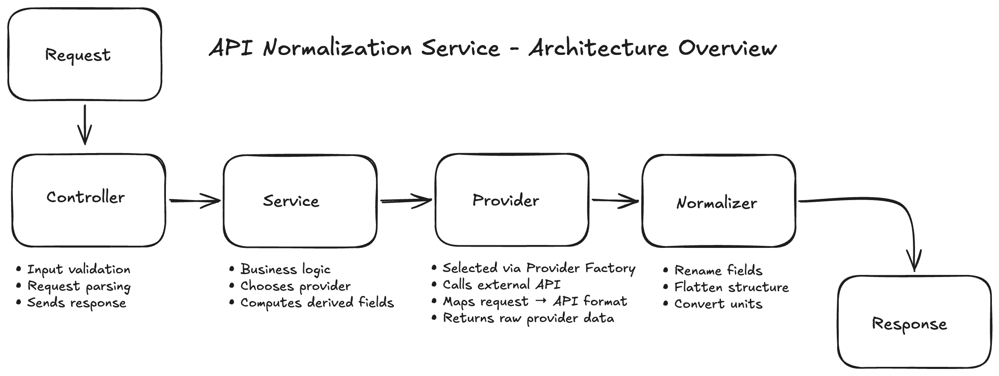

# API Normalization Service

A RESTful API service that consumes external data providers, normalizes inconsistent upstream responses into a unified internal contract, and returns a predictable response regardless of source implementation.

---

## Architecture Overview



The system is organized into clearly separated layers to ensure maintainability, extensibility, and provider swapability.

### Layers

**Controller**
- Handles HTTP requests
- Validates incoming input
- Sends normalized response

**Service**
- Contains core business logic
- Orchestrates workflow
- Computes derived fields
- Remains independent of upstream APIs

**Provider**
- Fetches data from external APIs or local sources
- Translates internal requests into provider-specific formats
- Selected dynamically via Provider Factory

**Normalizer**
- Converts raw provider data into the internal normalized contract
- Renames fields
- Flattens structures
- Converts units

---

## Normalized Response Contract

The purpose of this service is to guarantee a consistent output format regardless of the upstream data source.

### Endpoint

GET /weather

### Query Parameters

| Parameter | Type | Required | Description |
|----------|------|----------|-------------|
| lat | number | ✓ | Latitude |
| lon | number | ✓ | Longitude |
| provider | string | optional | Data source override |

### Response Shape

```json
{
  "location": "string",
  "temperature": number,
  "windSpeed": number,
  "condition": "string",
  "isFreezing": boolean
}
```

### Contract Guarantees

- Response structure remains stable regardless of upstream API.
- Provider changes require no modification to Controller or Service logic.
- All external inconsistencies are handled within the Provider + Normalizer layers.

---

## Provider Swapability

The application supports multiple upstream providers through a Provider Factory abstraction.

Adding a new provider requires:

1. Creating a new provider implementation.
2. Adding selection logic to the Provider Factory.
3. (If needed) Adding a matching normalizer.

No changes are required in:
- Controller
- Service
- API contract

---

## Project Structure

```
src/
│
├── controllers/
├── services/
├── providers/
│   ├── providerFactory.ts
│   └── implementations/
├── normalizers/
├── routes/
├── types/
└── utils/
```

---

## Setup Instructions

> *To be completed*

```
npm install
npm run dev
```

---

## API Usage

> *To be completed*

Example request:

GET /weather?lat=30.26&lon=-97.74

---

## Error Handling & Resilience

> *To be completed*

Planned considerations:

- Upstream API failures
- Timeouts
- Invalid responses
- Input validation errors

---

## Testing

> *To be completed*

---

## Design Decisions

> *To be completed*

Topics to discuss:
- Why layered architecture was chosen
- Provider abstraction strategy
- Normalization boundary placement
- Tradeoffs considered

---

## AI Usage & Development Process

This project intentionally incorporates AI-assisted development as part of the engineering workflow.

### Goals for AI Usage
- Accelerate boilerplate generation
- Support iterative refinement
- Maintain developer ownership of decisions

### How AI Was Used

> *(Fill in during development — keep notes as you work)*

Examples to include later:

- Initial architecture exploration
- Generating project scaffolding
- Iterating on provider abstraction
- Debugging and refinement
- Code review assistance

### Example Prompt Log

```
Prompt:
"Generate TypeScript interfaces for a provider abstraction layer."

Reason:
Define a consistent provider contract across implementations.

Outcome:
Used generated interfaces as baseline and refined manually.
```

### Philosophy

AI was used as a collaborative engineering tool rather than an autonomous code generator. All architectural decisions, design direction, and final validation were performed manually.

---

## Author

Zachary Fast
